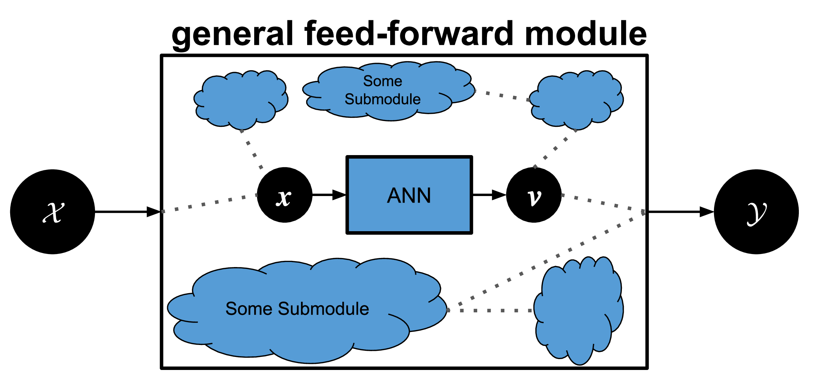

# GPEX
Let's say we have a general pytorch module. The module has at least one artificial neural network (ANN) as a submodule. 

GPEX replaces the ANN submodule with some Gaussian processes.
For doing so you will not be involved in details of the algorithm.
You only specify the ANN submodule and a few API functions, and GPEX does the rest under the hood.  

## Paper Results
You can find the notebooks in the "PaperResults/" directory.
For instance, the notebook for explaining the classifier on cifar10 is located in "PaperResults/Cifar10/demo_explainANN_classifier.ipynb" and the notebook
for explaining the attention subcomponent is located in "PaperResults/Cifar10/demo_explainANN_attention.ipynb".

To run the notebooks, you firstly  need to run the following python script to that downloads the models and datasets:

```shell
python setup_paperresults.py
```
If you want to download the material for a specific dataset, you can pass in one argument which has to either "cifar10", "mnist", "kather", or "dogswolves".
For example:
```shell
python setup_paperresults.py cifar10
```

Sometimes the above script fails to download the models from google drive due to, e.g., the download quota being exceeded. 
In this case, "after running the above script" you can manually download and place the models in the directories:


* Downlaod the model in [this link](https://drive.google.com/file/d/1aMJ5KBClnv0sLIAuckMK5I1YIYi2Tc61/view?usp=sharing) and save it as
   "Material_PaperResults/Models/ExplainClassifier/cifar10.pt"

* Downlaod the model in [this link](https://drive.google.com/file/d/1CUNmFgh_trvUvsqnhTYOqQ8geTQ7KSSd/view?usp=sharing) and save it as
   "Material_PaperResults/Models/ExplainAttention/cifar10.pt"
   
* Downlaod the model in [this link](https://drive.google.com/file/d/16Hbtnq-CtBZ91ToPJXrr0oBpMUTSdbo0/view?usp=sharing) and save it as
   "Material_PaperResults/Models/ExplainClassifier/mnist_classification.pt"
   
* Downlaod the model in [this link](https://drive.google.com/file/d/1g_Lod0zaeVv6iQ0uKmpK9bcesqE2yt-M/view?usp=sharing) and save it as
   "Material_PaperResults/Models/ExplainAttention/mnist_attention.pt"
   


 
