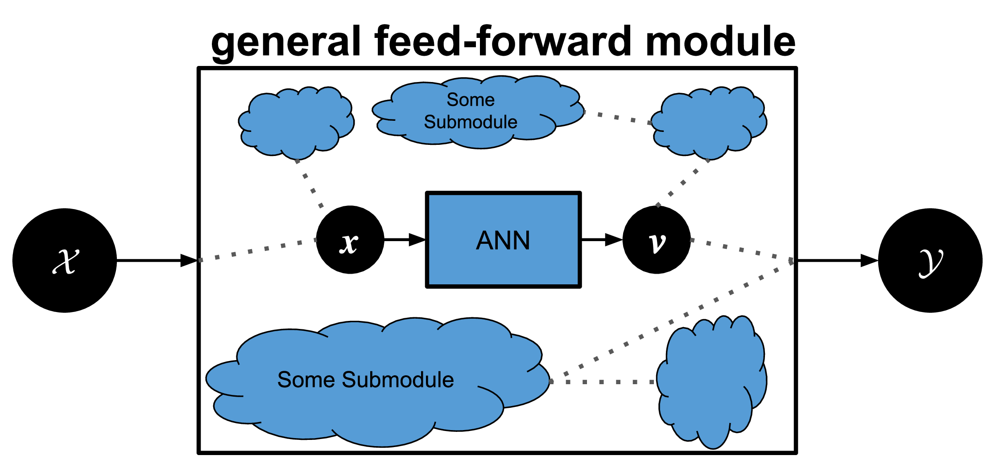

Welcome to GPEX's documentation!
===================================

.. contents:: Table of Contents
   :depth: 2
   :local:

.. currentmodule:: gpex

Introduction
------------------------
GPEX is a tool for performing knowledge distillation between Gaussian processes(GPs) and artificial neural networks (NNs).
It takes in an arbitrary pytorch module, and replaces one neural-network submodule to be replaced by GPs. 

The pytorch module can be quite general (as depicted above), with a few requirements:
    - It has to have on ANN submodule.
    - The ANN submodule has to take in one input tensor and one output tensor. The input has to be of dimension [Nx*], where * means any number of dimensions, but the output has to be of shape [NxD].

Usage (Distill from ANN to GP)
------------------------
A typical code is as follows: 

>>> .
>>> .
>>> .
>>> model = SomeModel() #your general pytorch module, it can be for example a classifier
>>> gpexmodule = gpex.GPEXModule(model, ...) #the main module that takes in your general pipeline and asks for different information (like the ANN submodule to be replace by GP, etc.).
>>> .
>>> .
>>> gpexmodule.init_UV() #this method has to be called to initialize internal parameters, i.e., the matrices U and V in the paper.
>>> for itr in range(num_iters):
>>>    .
>>>    loss = gpmodel.getcost_GPmatchNN() #This is the loss that matches the GP kernel to the ANN submodule.
>>>    loss.backward()
>>>    .
>>>    .
>>>    for _ in range(count_updateU):
>>>        gpmodel.update_U()
>>>        #The U matrices in the paper have to be updated frequently.
>>>        #Ideally `count_updateU` should be very large, so U is updated by going through the dataset onece.
>>>        #But in practice event when `count_updateU` is set to 1, convergence happens.
>>>    
>>>    if(itr%interval_renewXTX == 0):
>>>        gpexmodule.renew_precomputed_XTX()
>>>        #The function `renew_precomputed_XTX` should be called 
>>>        #   in every, e.g. 1000 iterations or so to avoid the propagation of a numerical error in internal computations.

Base Modules
------------------------

.. autoclass:: GPEXModule
   :members:
